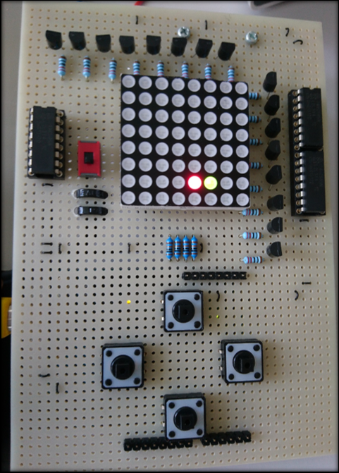

# SNAKE THE GAME

Entwicklung eines Snake-spiels basierend auf Arduino

## 1. Zusammenfassung

Dieses Dokument fasst die komplette Entwicklung und Herstellung eines **Snake** Spiels auf einer simplen Anzeige. Ich habe dieses Projekt in einzelne Arbeitspakete aufgeteilt.
Diese habe ich dann einzeln Systematisch abgearbeitet. Als erstes wurde das **Konzept** erstellt, **Testfälle** definiert und die **Schnittstellen** definiert.
Ein sehr wichtiger Schritt, in diesem Arbeitspaket wird das Fundament für das Projekt erstellt. Der zweite Schritt geht mehr in die **Hardware**. Hier habe ich ein Shield erstellt.
Die nächste Etappe ist die **Software**. Ich habe dazu passend wie in der Schnittstelle definiert eine Ausleselogik erstellt und diese mit der Spiellogik verknüpft.
Zu Schluss musste die **Hardware** und **Software** zusammengestellt und getestet werden.

### 1.1 Konzept

Das Konzept enthält Informationen zur Bedienung und Definition des Spieles sowie auf welcher Anzeige das Spiel gespielt wird. Als letztes wurden die Schnittstellen definiert.
Im ersten Arbeitspaket besteht das Ziel darin, das Projektmanagment so zu handhaben, dass die Zeitplanung und die Ziele von Anfang an klar gegeben sind.
Dazu muss am Ende dieses Arbeitspaketes die Bedienung, Hardware, Schnittstellen, Spieldefinition und die Testfälle klar definiert sein.

### 1.2 Wunschziele

Je nachdem wie schnell ich das Projekt verwirklichen kann, habe ich noch das Wunschziel am Schluss mithilfe eines Piezzobuzzer Soundeffekte zu generieren.
Das würde heissen, dass beim Aufnehmen von Futternäpfen und beim Sterben der Schlange, ein bestimmter Ton ausgegeben wird.
Mit dem Drehen eines Potentiometers kann zusätzlich die Lautstärke regeln.

### 1.3 Spieldefinition

Die Steuerung der Schlange erfolgt durch Cursor-Pfeiltasten. Das Spielfeld besteht aus einer LED Matrix mit roten und grünen LED’s.
Das Ziel ist es mit der Schlange (grüne LED’s) die sich im 500ms Takt bewegt, möglichst viele Futterhappen (rote LED) aufzunehmen.
Mit der Aufnahme jedes Futterhappens wird die Schlange um ein LED länger.
Zu beachten ist, dass Berührungen des Spielfeldrandes oder des eigenen Schwanzes zum Tod der Schlange führen und somit das Spiel beenden.
Am Ende des Spiels werden die angesammelten Futterhappen als Punktzahl auf der Anzeige visualisiert.  

### 1.4 Hardware Definition

Ich habe mich nach dem Informieren auf folgende Hardware Elemente geeinigt:

* Anzeige: Eine LED Matrix 8 x 8, mit rot und grünen LED
* Eingabe: Einzelne Taster für Richtungswechsel (pro Richtung eine Taste 4x)
* Ein / Ausschalter
* Simple Sound effekte mit einem Piezo Buzzer
* Logik wird auf ein Arduino gespeichert
* Für die Pinerweiterung verwenden wir ein 3x Shift Register (74HC595)
* Feldeffekttransistor BS270
* Potentiometer zur Lautsrärkenregelung
* Vorwiderstände (LED / Piezo)

### 1.5 Testfälle

* Das Spiel muss am Schluss von unserem Projekt, auf einer 8x8 Matrix mit vier Taster spielbar sein (gemäss Spieldefinition).
* Dieses Spiel soll auf einer Lochrasterplatine gelötet werden, welches wie ein Shield problemlos auf das Arduino aufsteckbar ist.
* Falls mehrere Taster auf einmal gedrückt und gehalten werden, soll der letzte gelesene Impuls übernommen werden.
* Wenn man nur kurz und ausserhalb von Takt der Schlangenbewegung den Taster betätigt, soll es diese Tasterrichtung speichern und zum Takt ausführen.
* Beim Betätigen von mehreren Tastern nacheinander, ausserhalb des Taktes der Schlangenbewegung, soll es den letzten eingegangener Taster Impuls übernehmen.
* Falls eine in entgegen gesetzter Richtungstaste geklickt wird (in Bezug auf die Schlangenbewegung), soll es keine Richtungsänderung geben.
